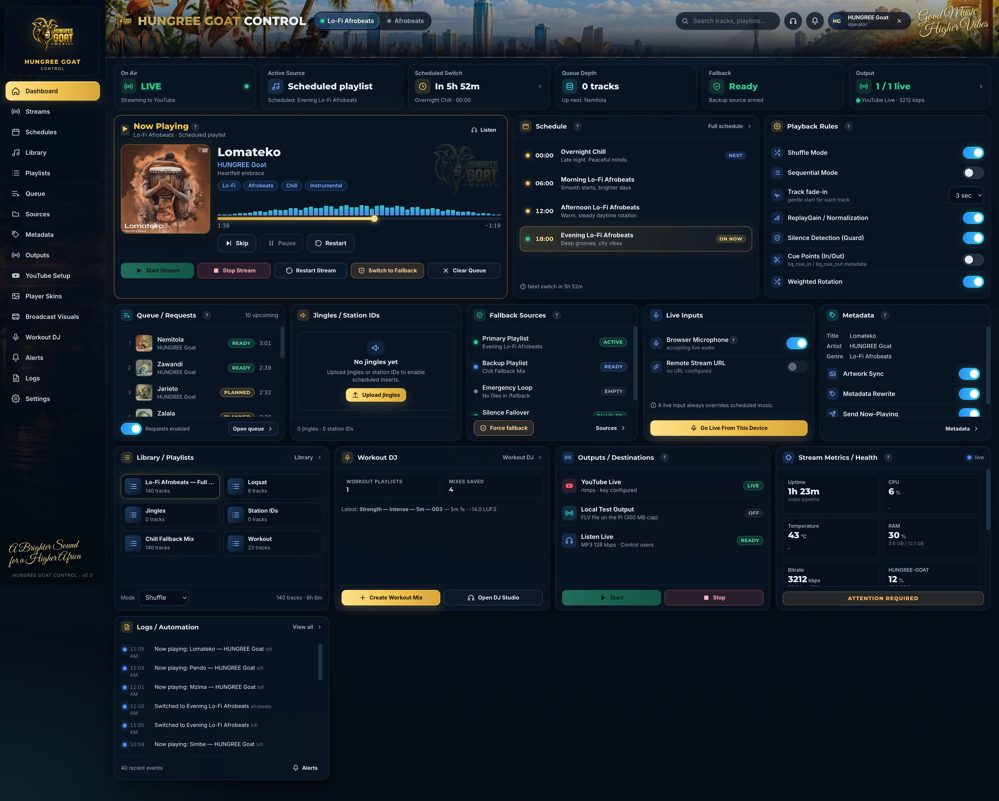
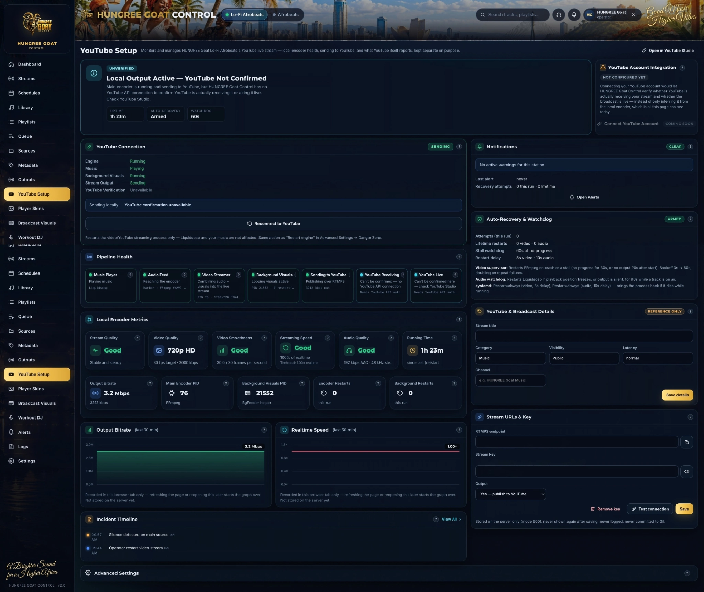

# HUNGREE Goat

HUNGREE Goat is a self-hosted 24/7 internet radio and music streaming platform.

It was originally built for Lo-Fi Afrobeats and includes a public music player, a
browser-based operator control panel, YouTube livestream broadcasting, playlists, a music
library manager, looping/animated broadcast visuals, automatic health monitoring and
recovery, and a browser-based DJ/mixing studio.

You can run HUNGREE Goat on your own Linux computer or home server.

HUNGREE Goat is created and maintained by **HUNGREE Goat Media**.

---

## What's New (2026-09-21)

A production incident (a YouTube broadcast silently stopped receiving data while every local
indicator still looked green) drove a real reliability pass:

- **True FFmpeg forward-progress watchdog.** The old stall check only looked at whether a
  fresh `-progress` heartbeat was still arriving — it could report healthy while the encoder
  was live-locked (heartbeat ticking, `frame`/`out_time` frozen). The watchdog (`StallDetector`,
  `apps/control/hgc/streamer.py`) now independently checks real forward progress, with
  regression tests pinning down the exact failure mode.
- **YouTube OAuth is now a fully verified, lifecycle-safe integration**: real channel
  identity, station-to-broadcast binding, and a **backend-authoritative legal transition
  state machine** — the dashboard can no longer offer Start Testing/Go Live on a broadcast
  the API would reject (a `complete` broadcast is terminal; this used to be a real UI bug).
- **`enableAutoStop=false` for 24/7 streams.** A temporary encoder stall used to be able to
  turn into a *permanently ended* broadcast, because YouTube auto-completes a broadcast whose
  `enableAutoStop` is on when ingest drops. New broadcasts default it off, with the
  auto-start/monitor-stream tradeoffs documented in [YouTube streaming](#youtube-streaming).
- **Semantic broadcast health** (`GET /v1/health/broadcast`) — a real health signal (encoder
  state, forward progress, YouTube ingest/lifecycle) instead of "the API process answered."
- **Independent external + local monitoring with push alerts**, and a new **Monitoring &
  Alerts** section in Control (Overview, Monitors, Notifications, Alert Rules, Incident
  History, Settings) with server-side telemetry history. See
  [Monitoring & Alerts](#monitoring--alerts) below.

## What does it do?

At its core, HUNGREE Goat plays your own music library on a loop, 24/7, and can
simultaneously:

- Serve that audio to a public website player, so anyone can listen live in a browser.
- Combine it with looping background visuals and a "Now Playing" overlay into a video
  feed, and broadcast that live to YouTube.
- Give you (the operator) a private dashboard to manage all of it — upload and organize
  music, build playlists, schedule what plays when, watch the stream's health, and step in
  when something needs fixing.

It's built to run unattended: if the audio engine or the video stream crashes, it restarts
itself automatically (see [How it works](#how-hungree-goat-works)).

## Features

**Available:**
- 24/7 automated music playback (scheduled playlists, fallback/backup sources, silence
  detection, weighted rotation, ReplayGain/loudness normalization, request queue)
- Public web player (`apps/player`) — a standalone site anyone can listen to, with mobile
  playback behavior handled explicitly (not just "hope autoplay works")
- Browser-based Control dashboard (`apps/control`) — the operator's private cockpit
- YouTube Live broadcasting over RTMPS, hardware-accelerated where available
- **YouTube OAuth integration** (optional, see [YouTube streaming](#youtube-streaming)):
  real connected-channel identity, automatic station-to-`liveStream`/`liveBroadcast`
  binding, and a backend-authoritative legal-transition state machine — the UI only ever
  offers a lifecycle action the API would actually accept
- **`enableAutoStop=false` resilience** for 24/7 broadcasts, so a temporary encoder hiccup
  can't turn into a permanently-ended broadcast
- **FFmpeg forward-progress watchdog** — detects a live-locked encoder (heartbeat alive,
  output frozen), not just a crashed process; automatic recovery with regression coverage
- **Semantic broadcast health** (`GET /v1/health/broadcast`) — real encoder + YouTube state,
  not just "the API process is up"
- **Monitoring & Alerts**: independent external (outside the house) and local (LAN) monitors,
  free push notifications via ntfy.sh, server-side telemetry history (fps/bitrate/realtime
  speed/YouTube state, 30m–7d ranges with LIVE/STALE/NO-DATA freshness), alert rules,
  incident history, and safe test/simulation controls — a dedicated Monitoring & Alerts
  section in Control (see [below](#monitoring--alerts))
- Playlists and music library management (upload, tag, organize, schedule)
- Looping/animated "broadcast visuals" behind the YouTube video feed, with sequential/
  shuffle/collection behavior
- Live encoder metrics in the dashboard: output bitrate, realtime speed, FPS, dropped
  frames, local encoder uptime kept distinct from YouTube live duration
- Automatic monitoring and recovery for the audio and video processes
- Multiple independent stations from one install (ships configured for two: Lo-Fi and
  Afrobeats)
- A public, read-only API (`/v1/*`) for the website/player to use
- A browser-based DJ/mixing studio (`apps/dj-studio`) for live or recorded mixes, including
  workout-DJ auto-mixing

**Planned / not yet built:**
- A single scripted installer (see [Quick start](#quick-start) for what that means today)
- Email and SMS alert escalation (the architecture supports it; no provider credentials are
  configured — see [Monitoring & Alerts](#monitoring--alerts))
- Uptime Kuma integration on the existing Pi monitoring host (pending its admin credentials)
- Operator-configurable alert-rule thresholds (currently fixed, sensible defaults in code)

## Screenshots

### Control Dashboard



Manage playback, schedules, playlists, music sources, broadcast outputs, metadata, health,
alerts, and station controls from one browser-based dashboard.

### YouTube Streaming & Health



Monitor the local streaming pipeline, stream quality, YouTube output, bitrate, realtime
performance, recovery status, warnings, and recent incidents. The screenshot above shows the
default, honest unverified status with no YouTube account connected: this app can always see
and control its own local encoder, but confirming YouTube itself is receiving the stream or
airing it live requires connecting a YouTube account (an optional, separate step) — see
[YouTube streaming](#youtube-streaming) below. The exact status wording has since been
refined (real semantic states like `VERIFIED LIVE`/`DEGRADED`/`YouTube Broadcast Ended`
instead of one generic "not confirmed" message) — the screenshot's underlying behavior is
still accurate, only some copy has changed; a refresh is planned but not blocking.

_Still needed: the public player, Broadcast Visuals, Workout DJ, and the new Monitoring &
Alerts section. Add them here the same way — real screenshots, checked for anything
account-specific before committing._

## Requirements

**Minimum**
- A Linux computer or server (this has only ever been run on Linux)
- [Docker](https://docs.docker.com/engine/install/)
- Git
- Your own music library (any of: mp3, m4a, aac, wav, flac, ogg, opus)
- Internet access (for YouTube broadcasting and the public player/API)

**Recommended**
- Ubuntu or Debian
- 8 GB+ RAM (the control, audio, and video processes reserve roughly 2 GB combined at
  their memory ceilings; more headroom matters if you also run other workloads on the box)
- A GPU with hardware video encoding (VAAPI on Intel/AMD, or `v4l2m2m` on a Raspberry Pi)
  — continuous 24/7 software encoding will otherwise keep a CPU core busy indefinitely
- A dedicated, always-on machine (a mini-PC, NUC, or similar) rather than a laptop that
  sleeps

**Optional**
- A domain name + reverse proxy/TLS, if you want the Control dashboard or public API
  reachable from outside your home network (see `infra/gateway/`)
- A YouTube channel with live streaming enabled and a stream key, if you want YouTube
  broadcasting
- A Google Cloud project with the YouTube Data API v3 enabled and an OAuth consent
  screen/client, plus HTTPS on your callback domain, if you want the optional real
  ingest/lifecycle verification instead of Stream-Key-Only mode — see
  [docs/youtube-oauth.md](docs/youtube-oauth.md)
- Hardware acceleration (see above) — HUNGREE Goat also works with `HGC_HW_BACKEND=software`

## Quick start

**There is not currently a single scripted installer** (no working `./install.sh`) — saying
otherwise would be documenting something that doesn't exist. What exists today is the exact
manual path below, built from the real Docker image, run scripts, and systemd units in
`infra/beelink/` (the current production deployment method). It's accurate, but it is
several manual steps, not one command. See [Installing HUNGREE Goat on a New
Computer](#installing-hungree-goat-on-a-new-computer) for the full walkthrough; this is the
short version:

```bash
git clone git@github.com:amaeteventurestudios/hungreegoat.git
cd hungreegoat
docker build -f infra/beelink/Dockerfile -t hungree-goat/hgc:latest .
```

Then follow the full installation section below — you still need to lay out `~/hungree-goat/`
on the host (app code + a `secrets/` directory you create yourself + your music), point a
media mount at `/media/hungree-goat`, and install the systemd units before anything actually
runs.

## Installing HUNGREE Goat on a New Computer

This assumes a fresh Ubuntu/Debian Linux machine and walks through what it would actually
take to rebuild HUNGREE Goat from GitHub plus a private backup of your own data (see
[Backups](#backups)).

1. **Install prerequisites**: Docker, Git, and — if you want hardware video encoding —
   your GPU's VAAPI drivers (e.g. `mesa-va-drivers` on Ubuntu for Intel/AMD).
2. **Clone this repository**:
   ```bash
   git clone git@github.com:amaeteventurestudios/hungreegoat.git ~/hungree-goat-src
   ```
3. **Build the image**:
   ```bash
   cd ~/hungree-goat-src
   docker build -f infra/beelink/Dockerfile -t hungree-goat/hgc:latest .
   ```
4. **Lay out the runtime directory** the app expects at `~/hungree-goat/`:
   ```bash
   mkdir -p ~/hungree-goat/app ~/hungree-goat/secrets ~/hungree-goat/run ~/hungree-goat/logs ~/hungree-goat/data ~/hungree-goat/bin
   cp -r apps/control/hgc apps/control/static ~/hungree-goat/app/
   cp infra/beelink/bin/*.sh infra/pi/bin/*.sh ~/hungree-goat/bin/ && chmod +x ~/hungree-goat/bin/*.sh
   chmod 700 ~/hungree-goat/secrets
   ```
5. **Attach or copy your music library** to `/media/hungree-goat/` (see [Music
   library](#music-library) below for the expected layout) — from a backup, an external
   drive, or by copying files in directly.
6. **Add your private secrets locally** — never from this repo. See
   [Secrets and security](#secrets-and-security).
7. **Initialize the database**: the app creates its SQLite database and operator account
   automatically on first start (see `apps/control/hgc/db.py`, `auth.py`) — there is no
   separate manual migration step today.
8. **Install and start services**:
   ```bash
   cp infra/beelink/systemd/*.service ~/.config/systemd/user/
   systemctl --user daemon-reload
   systemctl --user enable --now hungree-goat-control hungree-goat-liquidsoap@lofi hungree-goat-stream@lofi
   loginctl enable-linger "$USER"   # so these keep running after you log out
   ```
9. **Open Control**: `http://<this-machine>:8090` (or your reverse-proxied domain, see
   `infra/gateway/`). Sign in with the operator account the app created on first start (see
   `apps/control/hgc/auth.py` for exactly where that initial credential is written).
10. **Configure your station** — upload music, build playlists, set a schedule — from the
    Control dashboard.
11. **Configure YouTube** — see [YouTube streaming](#youtube-streaming) below.
12. **Verify stream health** — the YouTube Setup page's Pipeline Health and status banner
    should read "Healthy" (local, everything off) or "Unverified" (actively sending — this
    app can't confirm YouTube's side yet), never a false green "connected".

**The honest test for this section**: if the current machine disappeared tomorrow, could you
buy another Linux box, follow the steps above, restore your private files and music from a
backup, and get HUNGREE Goat running again? Today, yes — but only by following these manual
steps carefully; there's no single button for it yet. See `docs/RECOVERY.md` for the
disaster-recovery-focused version of this same checklist.

## Music library

Music lives **outside Git**, under a media mount at `/media/hungree-goat/` (configurable via
the `HGC_MEDIA` environment variable — see `apps/control/hgc/config.py`):

```
/media/hungree-goat/
├── music/          per-station subfolders; this is what the library scanner walks
├── artwork/        cover art
├── animation/      looping background-visual source clips
├── fallback/       the emergency/silence-failover loop
├── jingles/
├── station-ids/
└── playlists/
```

Supported audio formats: `mp3`, `m4a`, `aac`, `wav`, `flac`, `ogg`, `opus`.

The library is discovered by scanning `music/` — there's no separate "import" step; add
files to the right folder (or upload them through the Control dashboard's Library page) and
the scanner picks them up. Playlists are created and edited from the Control dashboard, not
by hand-editing files.

Music should **not** be committed to this repository — it's real audio content, not source
code, and doesn't belong in Git history.

## YouTube streaming

A YouTube **stream key** is a secret string YouTube Studio gives you (Go Live → Stream
settings) that authorizes whatever you send to that URL to appear as your channel's live
broadcast. Treat it like a password.

HUNGREE Goat stores it in `~/hungree-goat/secrets/youtube-<station>.env` (mode 600, on the
server only) — set it from the Control dashboard's YouTube Setup → Stream URLs & Key panel,
never by hand-editing a file with a real key in it. **Real stream keys must never be
committed to this repository** (see `infra/pi/youtube.env.example` for what the file
actually looks like, with a placeholder).

**Two modes, both fully supported:**

- **Stream-Key-Only** (the default, described above): HUNGREE Goat can tell you, with
  certainty, whether its own local encoder is running and actively *sending* data toward
  YouTube's server. It cannot confirm that YouTube is *receiving* that data, or that your
  broadcast is actually *live* to viewers — those are only knowable from YouTube Studio
  itself in this mode. The YouTube Setup dashboard says so plainly ("Unverified") rather
  than assume sending implies success. No Google account, no extra setup — this is what you
  get out of the box.
- **Connected Account** (optional): connect a YouTube account via OAuth (Google Cloud
  project + YouTube Data API v3 + OAuth consent screen — see
  **[docs/youtube-oauth.md](docs/youtube-oauth.md)** for the full walkthrough) and the same
  dashboard replaces "Unverified" with real, API-verified ingest status and broadcast
  lifecycle status, real channel identity, and station-to-stream/broadcast binding. It's
  entirely optional and additive: nothing in Stream-Key-Only mode changes, and losing the
  OAuth connection never affects local streaming.

### YouTube lifecycle rules (important if you ever bind/create a broadcast yourself)

YouTube's Live Streaming API enforces a real state machine — `created → ready → testing →
live → complete`, with `complete` **terminal** (a completed broadcast can never be
transitioned back). HUNGREE Goat's backend is the sole authority on which transition is
legal right now (`youtube_oauth.legal_transitions()`); the dashboard only ever shows a button
for an action the backend has confirmed isn't already known-illegal — it used to be possible
to see Start Testing/Go Live enabled next to a `complete` broadcast, both of which the real
API correctly rejected. That's fixed.

Three `contentDetails` fields matter a lot for a 24/7 station, and are worth understanding
before you create or repair a broadcast by hand:

- **`enableAutoStop`** — if true, YouTube will auto-*end* the broadcast after ingest drops
  for a while. For a 24/7 station this is dangerous: a temporary encoder stall (see the
  watchdog note below) can silently turn into a *permanently completed* broadcast. New
  broadcasts HGC creates default this to **`false`**.
- **`enableAutoStart`** — if true, YouTube's own automatic mechanism owns the ready→live
  transition, and **cannot be changed after the broadcast is bound to a stream** (the API
  returns `enableAutoStartModificationNotAllowed`). HGC defaults this to `false` for
  deterministic, HGC-driven control instead of waiting on an opaque auto-start timer.
- **`monitorStream.enableMonitorStream`** — if true, the legal path is
  `ready → testing → live`; if false, `ready → live` directly is legal once ingest is
  `active`/healthy. HGC defaults this to `false` for the same determinism reason above.

To reconnect a stream that's stopped sending, use the "Reconnect to YouTube" action on the
YouTube Setup page — it restarts the video/YouTube streaming process only (your music keeps
playing; the audio engine is a separate process and isn't touched).

### FFmpeg can be "running" and still not be sending anything

A real incident lesson worth internalizing: **a healthy-looking FFmpeg process does not mean
media is actually progressing.** FFmpeg can keep emitting a fresh `-progress` heartbeat on
schedule while its actual `frame`/`out_time` output has frozen — a live-lock, not a crash. The
watchdog (`StallDetector` in `apps/control/hgc/streamer.py`) checks three independent things,
not one: heartbeat recency, a first-heartbeat-never-arrived case, and — the one this incident
was missing — whether `frame`/`out_time` are actually advancing. See
`apps/control/tests/test_streamer_stall.py` for the regression coverage.

## Monitoring & Alerts

Full architecture in **[docs/monitoring-alerts.md](docs/monitoring-alerts.md)** — this is a
summary.

**Available:**
- A **Monitoring & Alerts** section in Control (Overview / Monitors / Notifications / Alert
  Rules / Incident History / Settings), backed by real data — not placeholder cards.
- **Semantic broadcast health**: `GET /v1/health/broadcast?station=<sid>` — the same real
  health (`healthy|degraded|critical|offline|unverified`, encoder state, YouTube ingest/
  lifecycle) the dashboard itself renders from, so a monitor's idea of "healthy" can never
  drift from Control's.
- **Two independent monitors**, deliberately outside the broadcast pipeline so monitoring
  failing can never affect streaming: an **external** one on the existing Hetzner gateway
  (sees a full home/power/ISP outage, which nothing inside the house can) and a **local** one
  on the existing Raspberry Pi (checks Beelink directly over the LAN, bypassing the public
  gateway — helps tell "the gateway/tunnel broke" apart from "the house is dark"). Neither
  needed new paid infrastructure or elevated credentials.
- **Push notifications** via ntfy.sh (free, no account) — outage, still-down reminders
  (cooldown, no alert storms), and recovery notifications with outage duration.
- **Server-side telemetry history** (fps, realtime speed, bitrate, YouTube state; 30m/1h/6h/
  24h/7d ranges, 7-day retention, downsampled for the longer ranges) that survives the
  browser tab closing — with explicit LIVE/STALE/NO-DATA freshness, current/min/avg/max, and
  sample age, so a flat line is never ambiguous between "stable" and "dead graph."
- **Alert rules** with sensible fixed defaults (YouTube ingest/lifecycle, FFmpeg stall in its
  three forms, Liquidsoap/silence/media-drive checks, speed/drop-frame degradation) —
  reusing the existing events/alerts system (deduplication, persistence, resolve-on-recovery)
  rather than a second, parallel incident tracker.
- **Safe test controls**: Send Test Push, Simulate Stream Down/Warning/Recovery — clearly
  labeled `[TEST]`, never touch Liquidsoap/FFmpeg/the real YouTube broadcast.

**Requires configuration:**
- **Email escalation** — `Provider configuration required`. No SMTP credentials exist yet;
  the escalation architecture (immediate push → 5 min unresolved → 10 min unresolved) is
  ready for it.
- **SMS escalation** — `Provider configuration required`, same architecture.

**Optional:**
- A dedicated small monitoring VPS (rather than the existing shared Hetzner account) — not
  required, the current setup works and costs nothing extra.
- Integrating with the Pi's pre-existing Uptime Kuma instance (used for unrelated personal
  services) — pending its admin login; documented monitors to add manually in the meantime.

## Start / stop / restart

HUNGREE Goat is four independent `systemd --user` units — restarting one never touches the
others:

```bash
systemctl --user restart hungree-goat-control          # dashboard + API
systemctl --user restart hungree-goat-liquidsoap@lofi  # this station's music engine
systemctl --user restart hungree-goat-stream@lofi      # this station's video/YouTube output
systemctl --user restart hungree-goat-tunnel           # reverse tunnel, only if you're using the gateway setup
```

(Replace `lofi` with your station id — this repo ships two, `lofi` and `afrobeats`.) You
can also start/stop/restart the video stream from the Control dashboard's Danger Zone,
without touching a terminal.

Deeper systemd/Docker details (resource limits, what each unit actually runs) live in
`infra/beelink/README.md`.

## Updating

1. `git pull` the latest code into your clone of this repository.
2. Rebuild the image if `infra/beelink/Dockerfile` or `requirements.txt` changed:
   `docker build -f infra/beelink/Dockerfile -t hungree-goat/hgc:latest .`
3. Copy the updated `apps/control/hgc` and `apps/control/static` into `~/hungree-goat/app/`
   (see `infra/pi/deploy.sh` for the exact rsync pattern this is based on — a Beelink-side
   equivalent script doesn't exist yet; this is currently a manual copy).
4. **Never overwrite**: anything under `~/hungree-goat/secrets/`, `run/`, `logs/`, `data/`
   (your database), or the media mount — none of that comes from Git.
5. Restart `hungree-goat-control` to pick up backend (Python) changes — static
   JS/CSS/HTML go live immediately since they're read from disk on each request; only
   Python needs a restart.
6. Only restart `hungree-goat-liquidsoap@<station>` or `hungree-goat-stream@<station>` if
   you changed something in that specific process's own code (`station.liq`,
   `streamer.py`) — both interrupt the live broadcast briefly, so don't restart them for an
   unrelated change.

Back up your database and secrets before any update you're unsure about (see below).

## Backups

**GitHub backs up the source code. It does not back up your private, running station.**
Before you'd ever need it, back these up separately and privately:

| What | Where it lives | Notes |
|---|---|---|
| Database | `~/hungree-goat/data/hungree-goat.sqlite3*` | tracks, play history, settings, schedules |
| Secrets | `~/hungree-goat/secrets/` | stream keys, operator credentials, session key — **never in Git** |
| Music library | `/media/hungree-goat/music/` | your actual audio files |
| Artwork | `/media/hungree-goat/artwork/` | |
| Broadcast visuals | `/media/hungree-goat/animation/` | |
| Playlists/metadata | `/media/hungree-goat/playlists/` and the database above | |
| YouTube OAuth token | `~/hungree-goat/secrets/youtube-oauth-token.json` | only if you've connected an account — see [YouTube streaming](#youtube-streaming) |
| Monitoring config | `~/hungree-goat/secrets/ntfy-topic.txt`, `infra/monitoring/*.sh` deployed on the two monitoring hosts | low-sensitivity but not public — see `docs/security.md` |
| Logs | `~/hungree-goat/logs/` | optional — useful for troubleshooting, not required for recovery |

See `docs/RECOVERY.md` for the full disaster-recovery checklist built around exactly this
list.

## Secrets and security

**Real secrets must never be committed to this repository.** Full stop.

What's local-only (already in `.gitignore`, verified — see the secret audit note in
`docs/RECOVERY.md`): `secrets/`, any `*.env` file, `operator.json`/`operator-password.txt`,
`*.key`/`*.pem`/`*.crt`/`*.token`, `run/`, `logs/`, `data/`, `*.sqlite3*`.

What's safe and tracked: example/template files with placeholder values only —
`apps/control/secrets.example.md` (documents what each secret file is, with no real values),
`apps/player/.env.example`, `infra/pi/youtube.env.example`. Copy these and fill in your own
values locally; never fill them in and commit the result.

Never expose, log, or commit: the YouTube stream key, `cdn.ingestionInfo.streamName` (the
same value as the stream key, under a different API field name), the OAuth client secret/JSON,
access/refresh tokens, SMTP or SMS provider credentials, the ntfy push topic, Uptime Kuma
credentials, session cookies, or any HGC authentication secret. Diagnostics and the Logs
export never include these. Filesystem permissions throughout `~/hungree-goat/secrets/` are
0700 (directory) / 0600 (files).

See `docs/security.md` for more.

## How HUNGREE Goat works

In plain English, before the technical diagram:

**Music Player (Liquidsoap)**
Keeps the station's music playing continuously — picks the next track, applies fades and
volume normalization, and falls back to a backup source or emergency loop if something's
wrong with the primary playlist.

**Video Streamer (FFmpeg)**
Combines the music and the background visuals — plus a "Now Playing" overlay — into the
outgoing video stream, encoded (in hardware, where available) and sent out over RTMPS.

**Background Visuals**
Supplies the looping/rotating visual content shown behind the video stream, switching once
per song.

**Control**
The browser dashboard (this repo's `apps/control`) used to manage the station — library,
playlists, schedule, YouTube setup, and live health monitoring.

**Player**
The public, listener-facing music player website (`apps/player`).

**YouTube Output**
Sends the finished video stream to YouTube over RTMPS, with an optional OAuth connection for
real ingest/lifecycle verification and lifecycle-safe controls. See [YouTube
streaming](#youtube-streaming) above.

**Monitoring** (see [Monitoring & Alerts](#monitoring--alerts))
A background watchdog inside Control persists telemetry and raises/resolves alerts on real
encoder and YouTube state. Two independent monitors — external (Hetzner gateway) and local
(Raspberry Pi, over the LAN) — check public reachability and semantic health from outside the
broadcast pipeline entirely, so a monitoring failure can never affect the stream, and push
outage/recovery notifications via ntfy.

Now the technical picture — component detail lives in `docs/architecture.md`:

```
hungreegoat.com ──┬── Listen Live ──▶ api.hungreegoat.com/v1/listen/lofi.mp3 ─┐
                  └── Watch YouTube ──▶ YouTube                               │
player.hungreegoat.com ── /v1/now-playing · up-next · schedule · stations ───┤   (public, read-only)
api.hungreegoat.com/v1/health/broadcast ── semantic health ───────────────────┤
                                                                             ▼
                                              gateway (nginx, TLS) ── SSH reverse tunnel ── broadcast host
control.hungreegoat.com ── LOGIN ── same gateway ── /api/* (private) ──────────────────────┤ ├─ HUNGREE Goat Control (FastAPI :8090)
                                                                                             │    └─ watchdog: telemetry + alerts (sqlite)
                                                                                             ├─ Liquidsoap 2.4.5 (Docker) ── AAC/MP3 mounts
                                                                                             └─ FFmpeg (hardware video) ── RTMPS ── YouTube (OAuth-verified)

hetzner-usg (gateway, external) ── cron ── checks public endpoints ──┐
pi-node-01 (LAN) ── cron ── checks Beelink directly over LAN ────────┴──▶ ntfy.sh push ──▶ your phone
```

## Repository layout

| Path | What it is |
|---|---|
| `apps/website` | The public HUNGREE Goat homepage (static, framework-free) |
| `apps/player` | The public music player (AGPL-3.0 — see `apps/player/NOTICE.md`) |
| `apps/control` | The operator dashboard and backend (FastAPI + a plain-JS SPA) — the bulk of the engineering lives here |
| `apps/dj-studio` | Browser-based DJ/mixing studio (built on the MIT-licensed Aurdour project — see `apps/dj-studio/NOTICE.md`) |
| `infra/beelink` | Current production deployment: Docker image, run scripts, systemd units |
| `infra/pi` | The original Raspberry Pi bare-metal deployment — legacy, kept as a working rollback target |
| `infra/gateway` | Public-facing nginx + SSH reverse-tunnel setup, so the private broadcast host is never directly exposed |
| `infra/monitoring` | External (Hetzner) and local (Pi) monitoring scripts — see [Monitoring & Alerts](#monitoring--alerts) |
| `packages/brand` | Shared brand assets — colors, fonts, logos |
| `packages/ui` | Shared public-facing UI primitives (CSS) |
| `packages/shared` | The public API client (`hg-api.js`) and the static-site build script |
| `docs/` | Architecture, deployment, development, DNS, security, and API reference docs |

## Troubleshooting

- **Music isn't playing** — check `systemctl --user status hungree-goat-liquidsoap@<station>`,
  then the Control dashboard's Pipeline Health (Music Player stage) and Logs page.
- **Control page won't open** — check `systemctl --user status hungree-goat-control`; if it's
  not running, `journalctl --user -u hungree-goat-control` for why.
- **YouTube isn't receiving the stream** — first check the YouTube Setup page's Pipeline
  Health: is "Sending to YouTube" actually green? If yes, this app genuinely can't tell you
  more without YouTube Studio itself (see [YouTube streaming](#youtube-streaming)) — check
  there directly. If "Sending to YouTube" is red, use Reconnect to YouTube.
- **Background visuals are unavailable** — check the Diagnostics section (Advanced Settings)
  for the background helper's PID and restart count; `0`/unavailable usually means the
  looping clip failed to decode (unsupported format/codec) and it's fallen back to the
  default loop.
- **Stream is running too slowly** (Streaming Speed reads "Too Slow"/below realtime) —
  usually CPU/GPU contention on the host, or software encoding without hardware
  acceleration available; check Advanced Settings → Diagnostics for the actual encoder
  in use.
- **Where are the logs** — `~/hungree-goat/logs/` on the host, or the Control dashboard's
  Logs page (Events / Audio engine / Video / Stream service / Control / Kernel).
- **How to restart only the right thing** — see [Start / stop / restart](#start--stop--restart)
  above; restarting Control never interrupts the live broadcast, restarting the stream or
  audio engine briefly does.

## Development

See `docs/development.md` for the full developer setup. In short:
- `apps/website`, `apps/player`: `npm run dev` in that directory (see each `package.json`).
- `apps/control`: Python (FastAPI) backend under `apps/control/hgc`, plain-JS SPA under
  `apps/control/static` (no build step — edit and reload). `apps/control/requirements.txt`
  for backend dependencies; `apps/control/tests` for its test suite.
- `apps/dj-studio`: static, no-build ES modules — see its own `package.json`/`NOTICE.md`.

## Contributing

1. Fork this repository.
2. Create a branch for your change.
3. Make your change and test it locally (see [Development](#development)).
4. Open a pull request describing what changed and why.

This project doesn't yet have a formal contribution guide beyond that — if you're planning
something larger than a small fix, opening an issue first to discuss it is a good idea.

## Community Edition

HUNGREE Goat Community Edition is free and open source under the **GNU Affero General
Public License v3.0 (AGPL-3.0)** — see the root [`LICENSE`](LICENSE) file for the full text.

You can use, study, modify, and self-host the Community Edition under the terms of the
AGPL-3.0. If you modify the AGPL-covered software and make that modified version available
to users over a network, the AGPL's network-use clause (section 13) requires you to also make
your modified source available to those users — this applies to the original HUNGREE Goat
code covered by the root `LICENSE`; components under their own licenses (see [License](#license)
below) follow their own terms instead.

This is a plain-English summary, not a substitute for reading the license itself or getting
your own legal advice.

## Commercial Licensing

Need to use HUNGREE Goat in a proprietary product, a white-label deployment, a closed-source
integration, or another commercial arrangement that doesn't fit the Community Edition's
AGPL-3.0 terms?

Commercial licensing is available from HUNGREE Goat Media for the original HUNGREE Goat code,
where HUNGREE Goat Media holds the right to offer alternative terms. This does **not** relicense
or change the terms of any third-party component bundled in this repository — `apps/player`,
`apps/dj-studio`, the bundled fonts, and everything else listed in
[`THIRD_PARTY_NOTICES.md`](THIRD_PARTY_NOTICES.md) remain governed by their own licenses
regardless of any commercial license for HUNGREE Goat's original code.

Contact [info@hungreegoat.com](mailto:info@hungreegoat.com?subject=HUNGREE%20Goat%20Commercial%20Licensing)
to discuss commercial licensing. See the [For Business](https://hungreegoat.com/business) page
for the managed-hosting option as well.

## License

HUNGREE Goat Community Edition — the original HUNGREE Goat code and documentation in this
repository (`apps/website`, `apps/control`, `packages/brand` excluding fonts, `packages/ui`,
`packages/shared`, `infra/`, and `docs/`) — is **Copyright © 2023–2026 HUNGREE Goat Media**
and licensed under the **GNU Affero General Public License v3.0 (AGPL-3.0)** — see the root
[`LICENSE`](LICENSE) file for the full text. Need different terms? See
[Commercial Licensing](#commercial-licensing) above.

Several components are separately licensed and are **not** covered by the root `LICENSE` —
see `THIRD_PARTY_NOTICES.md` for the full breakdown:

- **`apps/player`** is distributed under **AGPL-3.0** in its own right (it's a derivative of a
  third-party AGPL-3.0 project, copyright Gilles Momeni) — see `apps/player/LICENSE` and
  `apps/player/NOTICE.md` for exactly what that requires (including that this repository's
  player source stay published).
- **`apps/dj-studio`**'s DJ engine is built on **Aurdour** (MIT) and its mastering DSP on
  **noisyloop/mastering** (ISC) — see `apps/dj-studio/NOTICE.md` for the full, file-by-file
  provenance breakdown, and `THIRD_PARTY_NOTICES.md` for the copyright holders.
- Third-party runtime components keep their own licenses regardless of the above:
  Liquidsoap (GPL-2.0), FFmpeg (LGPL/GPL depending on build), fonts (SIL OFL 1.1).

The root `LICENSE`'s AGPL-3.0 grant applies only to the code and documentation original to
this repository — it does not and cannot override the separate licenses above.

If you're evaluating this repository for a public/open-source release, read `docs/RECOVERY.md`'s
open-source-readiness notes first — the root `LICENSE` and the AGPL-3.0 `apps/player`
subtree currently make different promises, which needs a deliberate decision, not an
assumption, before going public.
